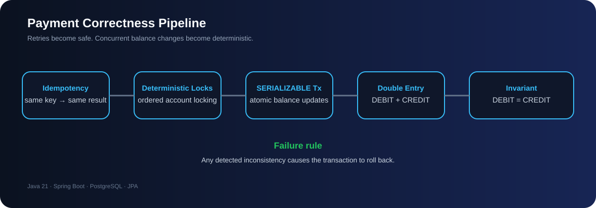

# 💳 Idempotent Payment & Double-Entry Ledger API

<p align="center"><strong>Reliable payment processing with idempotency, transaction safety and accounting correctness.</strong></p>

<p align="center">   </p>

> A Spring Boot REST API that treats a payment as a correctness problem: retries must be safe, concurrent balance updates must be controlled, and every successful transfer must remain balanced in the ledger.

## 🎯 What This Project Demonstrates

- Idempotent APIs with Idempotency-Key
- SERIALIZABLE transactions and deterministic account locking
- Concurrent-safe balance updates
- Double-entry accounting with DEBIT = CREDIT
- PostgreSQL + Spring Data JPA
- Pagination, validation and consistent API error handling

## 🧭 Engineering Case Study

| Concern | Design decision | Why it matters |
|---|---|---|
| Duplicate requests | Idempotency-Key + request conflict detection | Retries do not create duplicate payments |
| Concurrency | Deterministic account locking + SERIALIZABLE | Conflicting balance updates are controlled |
| Accounting | Double-entry ledger with DEBIT = CREDIT | Every successful transfer preserves a core invariant |
| Recovery | Validation inside the transaction | Detected inconsistency triggers rollback |

<p align="center">
  
</p>

## Features

- Create payments between accounts
- Idempotent payment processing with `Idempotency-Key`
- Detect conflicting reuse of an idempotency key
- Concurrent-safe account balance updates
- Deterministic account locking
- `SERIALIZABLE` payment transactions
- Double-entry ledger (DEBIT + CREDIT)
- Ledger balance validation (`DEBIT = CREDIT`)
- Payment details with ledger entries
- Account balance lookup
- Paginated account transaction history
- Payment ledger consistency check
- Resource-not-found handling
- PostgreSQL + Spring Data JPA
- Request validation

> JWT authentication and security have already been implemented in the Shortify URL Shortener project and are intentionally not duplicated here.

## Tech Stack

- Java
- Spring Boot
- Spring Web
- Spring Data JPA
- Spring Validation
- PostgreSQL
- Lombok
- Maven

## API Endpoints

Base URL:

```text
http://localhost:8082
```

### 1. Create Payment

```http
POST /api/v1/payments
```

Headers:

```http
Content-Type: application/json
Idempotency-Key: payment-001
```

Request:

```json
{
  "fromAccount": "ACC-1001",
  "toAccount": "ACC-2001",
  "amount": 500.00,
  "currency": "INR"
}
```

Response:

```json
{
  "transactionReference": "TXN-xxxxxxxx",
  "status": "COMPLETED",
  "amount": 500.00,
  "currency": "INR",
  "createdAt": "2026-08-18T18:30:00"
}
```

### 2. Get Payment Details

```http
GET /api/v1/payments/{transactionReference}
```

Returns the transaction and its DEBIT/CREDIT entries.

Example:

```json
{
  "transactionReference": "TXN-xxxxxxxx",
  "status": "COMPLETED",
  "amount": 500.00,
  "currency": "INR",
  "createdAt": "2026-08-18T18:30:00",
  "entries": [
    {
      "accountNumber": "ACC-1001",
      "entryType": "DEBIT",
      "amount": 500.00
    },
    {
      "accountNumber": "ACC-2001",
      "entryType": "CREDIT",
      "amount": 500.00
    }
  ]
}
```

### 3. Get Account Balance

```http
GET /api/v1/accounts/{accountNumber}/balance
```

### 4. Get Account Transactions

```http
GET /api/v1/accounts/{accountNumber}/transactions?page=0&size=10
```

Returns paginated DEBIT/CREDIT ledger entries.

### 5. Check Payment Consistency

```http
GET /api/v1/payments/{transactionReference}/consistency
```

Example:

```json
{
  "transactionReference": "TXN-xxxxxxxx",
  "debitTotal": 500.00,
  "creditTotal": 500.00,
  "balanced": true,
  "status": "BALANCED"
}
```

## Idempotency

Every payment requires an `Idempotency-Key`.

If the same key is retried with the same request, the existing transaction is returned instead of creating a duplicate.

If the same key is reused with different request data, the API returns an idempotency conflict.

Flow:

```text
Request
  |
  v
Check Idempotency-Key
  |
  +-- Existing + same request --> Return existing transaction
  |
  +-- Existing + different request --> Conflict
  |
  v
Create payment
```

## Concurrency & Transaction Safety

Payment creation uses:

```java
@Transactional(isolation = Isolation.SERIALIZABLE)
```

The source and destination accounts are locked in deterministic account-number order before balances are modified.

This protects against concurrent requests attempting to update the same accounts.

## Double-Entry Ledger

Every successful payment produces:

```text
Source Account       DEBIT   ₹500
Destination Account  CREDIT  ₹500
```

The fundamental invariant is:

```text
Total DEBIT = Total CREDIT
```

`validateLedgerBalance()` is called before the payment transaction completes. If an imbalance is detected, an exception causes the surrounding database transaction to roll back.

## Transaction Flow

```text
POST /api/v1/payments
        |
        v
Validate request
        |
        v
Check Idempotency-Key
        |
        v
Lock accounts
        |
        v
Validate status/currency/balance
        |
        v
Debit source
        |
        v
Credit destination
        |
        v
Create transaction
        |
        v
Create DEBIT entry
        |
        v
Create CREDIT entry
        |
        v
Validate DEBIT = CREDIT
        |
        v
Store idempotency record
        |
        v
COMMIT
```

## Error Handling

Typical responses:

| Status | Meaning |
|---|---|
| `400` | Invalid request, insufficient balance, inactive account, currency mismatch, invalid pagination |
| `404` | Account or payment not found |
| `409` | Idempotency key conflict |

## Database Model

Core entities:

```text
Account
   |
   | 1
   | *
LedgerEntry
   |
   | *
LedgerTransaction

IdempotencyKey
      |
      v
LedgerTransaction
```

### Account

- Account number
- Currency
- Balance
- Status

### LedgerTransaction

- Transaction reference
- Amount
- Currency
- Status
- Created timestamp

### LedgerEntry

- Transaction
- Account
- Entry type
- Amount

### IdempotencyKey

- Idempotency key
- Original request details
- Associated transaction

## Running Locally

Prerequisites:

- Java
- Maven
- PostgreSQL

Configure your PostgreSQL connection in:

```text
src/main/resources/application.yml
```

Example:

```yaml
spring:
  datasource:
    url: jdbc:postgresql://localhost:5432/idempotent_ledger
    username: postgres
    password: ${DB_PASSWORD}

  jpa:
    hibernate:
      ddl-auto: update
```

Start:

```bash
mvn spring-boot:run
```

Or:

```bash
mvn clean package
java -jar target/*.jar
```

## Recommended Test Sequence

1. Create a payment.
2. Repeat the same request with the same `Idempotency-Key`.
3. Verify no duplicate transaction is created.
4. Reuse the key with different request data and verify `409`.
5. Retrieve the transaction.
6. Verify one DEBIT and one CREDIT entry.
7. Check both account balances.
8. Check account transaction history.
9. Check payment consistency.
10. Run concurrent payment tests and verify balances and ledger entries remain correct.

## Engineering Concepts Demonstrated

- REST API design
- Spring Boot
- Spring Data JPA
- PostgreSQL
- Transaction management
- Serializable isolation
- Pessimistic locking
- Idempotent APIs
- Concurrent request handling
- Double-entry accounting
- Ledger consistency
- Pagination
- DTO-based API design
- Exception handling
- Database integrity

## Future Improvements

- OpenAPI / Swagger
- Docker Compose
- Testcontainers
- Redis-based idempotency
- Kafka/event publishing
- Audit logging
- Micrometer/Actuator observability
- CI/CD
- Production secret management
- Account ownership and authorization

## Author

**Rahul Moundekar**

Java • Spring Boot • REST APIs • React • PostgreSQL • Distributed Systems
